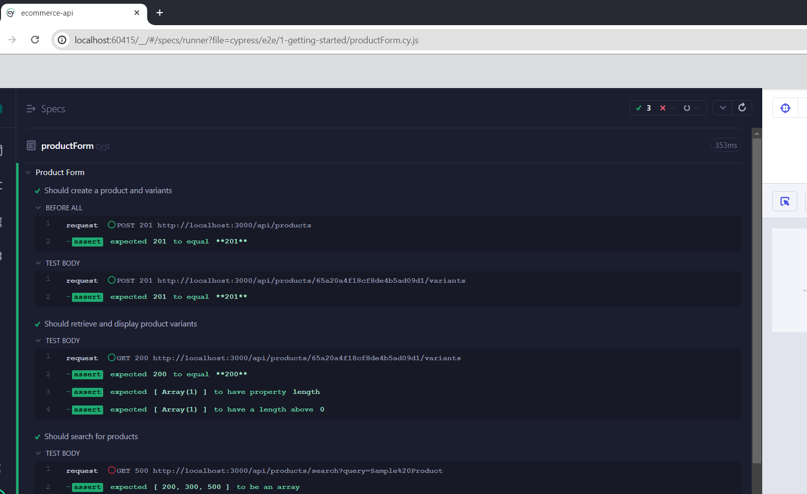

# eCommerce App API Documentation
## Introduction
The eCommerce Api built using Node.js, MongoDb. Using this api you can perform CRUD operation on both Products and Variants with Postman 

## project intialization.
* NOTE: make sure to have all the tools like Node.js, MongoDB are installed in your system with supportive version.
* Open a Terminal to Install all dependencies.
```bash
npm install
```
* Add this in package.json:
```bash
"scripts": {
    "start": "nodemon app.js"
    }
```
* Run below command to start.
```bash
npm start
```

# 1. CURD operations for both product and variant with Postman

### NOTE: use url + endpoints together to perform crud operations, URL =>(http://localhost:3000)
#### creating/adding product to database:
* Method **"POST"**.
* Endpoint **"/api/products"**.
* In Headers selct key as **"Content-type"** and   Vaulue as **"application/json"**.
* In Body select **"raw"** and slect **"JSON"** in the dropdown menu.
* Add your product details as shown below and click **"send"** button.
* Example: you can see the output as show below.
  


#### retrieve/read product from database:
* Method **"GET"**.
* Endpoint **"/api/products"** to get all products.
* To retrieve praticular product use **"/products/:productId"**.
* click "send".

#### update product from database:
* Method **"PUT"** or **"PATCH"**.
* Endpoint **"/products/:productId"** (Replace prouductId with actual Id of the product).
* In Headers selct key as **"Content-type"** and   Value as **"application/json"**.
* In Body select **"raw"** and slect **"JSON"** in the dropdown menu.
* Add the product fields to update or replace.
* click **"send"**.

#### delete product from database:
* Method **"DELETE"**.
* Endpoint **"/products/:productId"** (Replace prouductId with actual Id of the product).
* click **"send"**.

#### creating/adding variant to database:
* Method **"POST"**.
* Endpoint **"/products/:productId/variants"** (Replace prouductId with actual Id of the product).
* In Headers selct key as **"Content-type"** and   Value as **"application/json"**.
* In Body select **"raw"** and slect **"JSON"** in the dropdown menu.
* Add ur variant details and click **"send"** button.

#### retrieve/read variant from database:
* Method **"GET"**.
* Endpoint **"/products/:productId/variants"** (Replace prouductId with actual Id of the product).
* click **"send"**.


#### update variant from database:
* Method **"PUT"** or **"PATCH"**.
* Endpoint **"/products/:productId/variants/:variantId"** (Replace prouductId and variantId with actual Id).
* In Headers selct key as **"Content-type"** and   Value as **"application/json"**.
* In Body select **"raw"** and slect **"JSON"** in the dropdown menu.
* Add the variant fields to update or replace.
* click **"send"**.

#### delete product from database:
* Method **"DELETE"**.
* Endpoint **"/products/:productId/variants/:variantId"** (Replace prouductId and variantId with actual Id).
* click **"send"**.


# 2. Search functionality
### searching product by its name:
* Method **"GET"**.
* Endpoint **"/products/search"** (U have to use '?' and 'q', if any space present replace that with '%20').
* Example: http://localhost:3000/api/products/search?q=Sample%20product
* click **"send"**.

# 3. Test Driven Development
### This techninque is use to ensure that all functionality of the code working properly.
* There many TDD tools like Jest, Mocha and Chai, AVA , Cypress etc.
* We are using Cypress.
#### Cypress Installation 

Open a Terminal to Install and use cypress

```bash
npm install --save-dev cypress
```
* change ur scripts in package.json like below:
```bash
 "scripts": {
    "start": "nodemon app.js",
    "open": "npx cypress open"
  }
```

* To run the test use below command:
```bash
npm run open
```
* After running the above command Cypress interface will open.
* Select **E2E Testing**
* Select any browser.
* select the **productForm.cy.js** and click to run the test.
* File structure in the interface might look like this:
 ```bash
 📒 cypress\e2e\1-getting-started
       📄 productForm.cy.js
 ```

* After the analysis u will see the success result as shown in image:





# Features Fulfilled

- &#9745; Endpoints to create, update, delete and retrieve products.

- &#9745;  A product should have at least a name, description, price, and can have multiple variants.

- &#9745; A variant should have a name, SKU, additional cost (compared to base product cost), and stock count.

- &#9745; When creating a product, the API should handle creating/updating/deleting variants too.

- &#9745; An endpoint that allows searching products by product name, description, or variant name.

- &#9745; Write tests for the model to ensure data is being stored and retrieved correctly.

- &#9745; Write tests for each endpoint to ensure they function as expected.

- &#9745; Write tests to ensure the search functionality works as expected.


